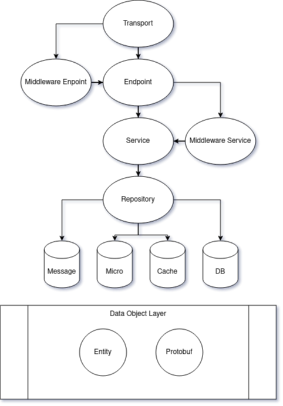

## About
go-kit service is a template for building microservice using golang with tranport `http` or `grpc`.

## Structure Project
```
.
├── cmd
│   ├── grpc
│   ├── http
│   └── migrate
├── endpoint
├── entity
├── mock
├── pkg
│   ├── bcrypt
│   ├── env
│   └── logger
├── proto
├── repository
│   └── postgres
├── resource
│   ├── migration
│   ├── seeder
│   └── view
├── service
├── transport
│   ├── grpc-trans
│   └── http-trans
└── validate
```
| Directory   | Description |
| :-          | :-          |
| cmd         | ... 
| endpoint    | ...
| entity      | ...
| mock        | ... 
| pkg         | ...
| proto       | ...
| repository  | ...
| resource    | ...
| service     | ...
| transport   | ...
| validate    | ...


## Table of Content
- [Guide](#guide)
    - [Pre-Development](#pre-development)
    - [Tech Stack](#tech-stack)
    - [Commands](#commands)
    - [Example](#example)
- [Rules](#rules)
    - [Package Name](#package-name)
    - [Filename](#filename)
    - [Folder](#folder)
    - [Folder](#folder)
- [Style](#style)
    - [Unnecessary Else](#unnecessary-else)
    - [Use Raw String Literals to Avoid Escaping](#use-raw-string-literals-to-avoid-escaping)
- [Patterns](#patterns)
    - [Test Tables](#test-tables)
    - [-](#introduction)

## Guide
Before starting to use this project, it is a good idea to read the guide below.

### Pre-Development
- Go (Golang) is an programming language [More Info](https://golang.org)
- Git version control of source code [More Info](https://git-scm.com)
- GNU Make for running a command [More Info](https://www.gnu.org/software/make)
- Docker is an open platform for developing, shipping, and running applications. [More Info](https://www.docker.com)
- Goose for create migration file and run migration to database [More Info](https://github.com/pressly/goose)

### Tech Stack
- x/crypto [github](https://github.com/golang/crypto) or [website](https://pkg.go.dev/golang.org/x/crypto)
- gorilla/mux [github](https://github.com/gorilla/mux) or [website](https://www.gorillatoolkit.org)
- go-kit/kit [github](https://github.com/go-kit/kit) or [website](https://gokit.io)
- go-kit/log [github](https://github.com/go-kit/log) or [website](https://gokit.io)
- lib/pg [github](https://github.com/lib/pg) or [website](https://pkg.go.dev/github.com/lib/pq)
- go-playground/validator [github](https://github.com/go-playground/validator) or [website](https://pkg.go.dev/github.com/go-playground/validator/v10)
- joho/godotenv [github](https://github.com/joho/godotenv) or [website](https://pkg.go.dev/github.com/joho/godotenv)

### Commands
```sh
# how to generate server.key and server.crt
make gentls
```

```sh
# how to run application
make run
```

```sh
# how to run migration
make migrate
```

```sh
# how to create migration file
make migration
# or
make migration filename=foo
```

```sh
# how to run test
make test
```

```sh
# how to run test with covarage
make cover
```

### Example
```go
package main

import "fmt"

func main() {
    fmt.Println("Hello World")
}
```

## Rules
Please use these rules to be consistent.

### Package Name
- All lower-case. No capitals or underscores.
- Not plural. For example, `net/url`, not `net/urls`.
- Not `common`, `util`, `shared`, or `lib`. These are bad, uninformative names.

### Filename
- Lower snake case. For example, `file_name.go` or `filename.go`
- No dash. For example, `file-name.go` ❌

### Folder
- All lower-case. No capitals or underscores.
- Use dash. For example, `resource`
- Not plural. For example, `view`, not `views`.

## Style
Please use these style to be consistent.

### Unnecessary Else
```go
// Bad
var a int
if b {
  a = 100
} else {
  a = 10
}

// Good
a := 10
if b {
  a = 100
}
```

### Use Raw String Literals to Avoid Escaping
```go
// Bad
wantError := "unknown name:\"test\""

// Good
wantError := `unknown error:"test"`
```

## Patterns
Please use these patterns to be consistent.

### Test Tables
Use table-driven tests with subtests to avoid duplicating code when the core test logic is repetitive.
```go
// Bad
host, port, err := net.SplitHostPort("192.0.2.0:8000")
require.NoError(t, err)
assert.Equal(t, "192.0.2.0", host)
assert.Equal(t, "8000", port)

host, port, err = net.SplitHostPort("192.0.2.0:http")
require.NoError(t, err)
assert.Equal(t, "192.0.2.0", host)
assert.Equal(t, "http", port)

// Good
tests := []struct{
  give     string
  wantHost string
  wantPort string
}{
  {
    give:     "192.0.2.0:8000",
    wantHost: "192.0.2.0",
    wantPort: "8000",
  },
  {
    give:     "192.0.2.0:http",
    wantHost: "192.0.2.0",
    wantPort: "http",
  },
}

for _, tt := range tests {
  t.Run(tt.give, func(t *testing.T) {
    host, port, err := net.SplitHostPort(tt.give)
    require.NoError(t, err)
    assert.Equal(t, tt.wantHost, host)
    assert.Equal(t, tt.wantPort, port)
  })
}
```
